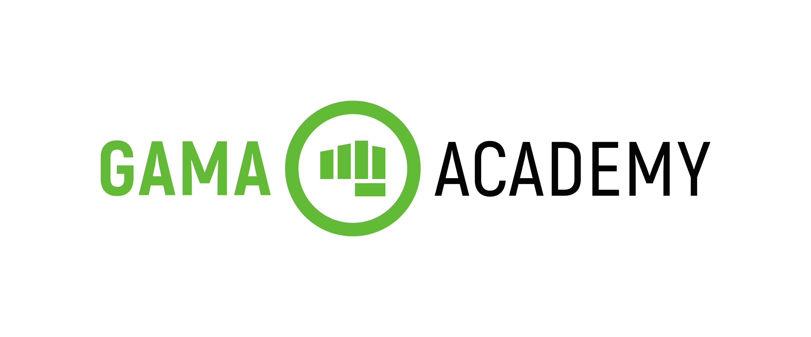
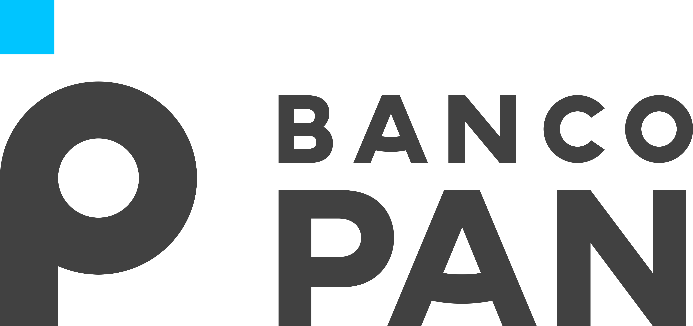

# BlueBank - Projeto Final PanAcademy

## Desenvolvedores

Projeto desenvolvido pelo grupo 2 - Squad Undefined Coders 

<table>
  <tr>
    <td align="center"><a href="https://github.com/CarmoPJunior"> <b>Carmo Júnior</b></a> </td>
    <td align="center"><a href="https://github.com/felipecandidoo"> <b>Felipe Cândido</b></a> </td>
    <td align="center"><a href="https://github.com/zecarlos558"> <b>José Carlos</b></a> </td>
    <td align="center"><a href="https://github.com/tiagodalmeida87"> <b>Tiago Almeida</b></a> </td>
  </tr>
</table>

## Professores

- Ana Verônica
- [Jennifer Plácido](https://www.linkedin.com/in/jenifer-pl%C3%A1cido-00b5611ab/)
- Jonathan Ferreira

## Objetivo

Desenvolver uma aplicação de um banco fictício BlueBank. O sistema deve gerenciar as transações e cadastros de clientes, permitindo incluir os dados pessoais e dados para contato. No sistema o cliente vai ser atrelado a uma conta bancária e registrar histórico de transações entre contas. Software desenvolvido conforme os requisitos descritos no documento do projeto final [Projeto Final PanAcademy](banco_pan_desafio_final_bluebank.pdf)

## Modelagem do Software

O sistema foi representado de forma visual sua estrutura a partir do modelo de diagrama de Classes, o qual foi dividido entre as camadas do MVC as classes a serem implementadas, facilitando a divisão de tarefas entre os membros da equipe.

### Diagrama de Classes

Ainda a definir versão final ...

###### Link Diagrama de Classes: [Diagrama de Classes - Blue Bank](https://viewer.diagrams.net/?tags=%7B%7D&highlight=0000ff&edit=_blank&layers=1&nav=1#R7V1bc9o4FP41zGQfmsFX4DGQbLvTdDfbpLO7fVNsBdQ1iMqiCfvrV7JkG1uyMcEKSUcznQbrYuxz0fn06UgMvNny6T0B68UnHMNk4A7jp4F3OXBddxi67A8v2YoSz%2FFkyZygWJQ5ZcEt%2Bg%2FKwqEs3aAYppWGFOOEonW1MMKrFYxopQwQgh%2BrzR5wUv3WNZhDpeA2Aola%2BheK6UKUjt1RWf4Bovki%2F2YnnIiaJcgbyzdJFyDGjztF3tXAmxGMqfi0fJrBhEsvl4vo92tDbfFgBK5olw7fwwX8OsZ%2FbKffwfWfs09fwef0nbzLD5Bs5AsvhQ6zJ6bbXAzs4df8I5cfJANv%2BoBX9FbWO%2Bw6XYMIreZ3eM0LhqyEgvtcYr68LiTl%2BKLgBqeIIrxiRQl8YDXTBV0m8pbqC%2BZPCwmFTztF8oXfQ7yElGxZE1kbSNlL63vnOBNZ8lgqczSUZYsdRY5yAwTSgObFzUsZsw9SzAeI3FWEC2NmcvISE7rAc7wCyVVZOiV4s4ohvyuXZNnmGgt5s8JvkNKt9B%2BwobijLFO8IRFseVxPOh0gc0jbLEl6BH%2BZVtUQmACKflT9q3cpe4phRwliLw9V035EywSsoMaoQYLm3DYj3pFbPbc8xAaHC1lBufin0QIl8TXY4g0XUEpB9G9%2BNV1ggv5jtwW5Jlg1oVJPblhpcct7Sh0TmLI2N7nCnFrRJ%2FBUaXgNUioLIpwkYJ2i%2B%2BI1lkx3aDXFlOKlbNSDbzljxblC1bmcQONcxZjYu9p9Re3vZJcL%2Fpe9LJM5i0JcBrxmxb6X%2FRHVKSVsCKu1iNYP7Q0g80wCBzNvcDHCol21qNo8BhRcwt9BGqElEz5u%2B2puFXmLa5Tyh09opmJR4YZzmilT7SY6zbKPZbVi%2FEzXNDNKgv%2BFM5xgZuWXKyy8ASVJrSh3CDlY691BhoLrrM2lX5Z8lhbAizDr%2B5Bk8XCB4hiuslGOvRUQdsufdo2ZwjILCabsH7OZ2fA8GATswWfs2imv2T%2FenFD2wuxdAMqsGjKneIQp1dp766ix3wmk0XPRdrF4x%2FMNWXygWLyi5ARlyhNKzmOy8ywNL5musohUiffvHEXtnqp2T6PiBNzDZAcFENG2pvpTabfzgGYMLIQa7U45LGbRHpKUuTZYZj4nrs9%2BqTj7VAwBTGabiGKiqf0A0sWMIb7iRlffNyDJ7mNHin5tadTRlgJTtjRSbKkWpyww6gUY%2Bb4CjFyN7kMdMBqaUv74QGCE4pnEyw0NEjwnbEK7Ia0IBsUghm3giWk9brvDarOE%2BVeoDxHBtR2o2geqUWfzbYE0Olt1jAW9iYU0xrTreB3VOzak3NxqLKR58yOF4%2FvdbCkITRmTyl8Wc2OLZvpBM14NzYw1FKo%2BQISmAoTj9o1mBMy4hHeQeXfm7s2QZQlQUq2340orM9zd5g6EICNTpIqj0scWgvSmXmfYcQQxhkFUmthikDc6VjjDcUcQ4pqypkDR6gus6DE5ku3fsn928Q%2B%2FOPdCNy%2B4fNqtvtzuXt1Agtjrc7jTjhT2LhBKX9q7QCjV9ErWB53wFEo7Wsr9SU92vcEZGGpGe6MaiBN6lt1KJVwQArY7zeTQ0fxFwzpJNhzW8hf29cgfrbFD07uUdiOeurSiQpBHGJZKs4oFOTsh6WdC4ozd86Cq2ImOX%2FUDNQaYW6hxeidYKVrjWbmUW17qZi47DdU7gTlcRaixOgVJTsHGeMPVV61foJShHBThOwJWqboaTXkxEKsI%2FP9pANNyadrinS5ZM8fNjXSmPjY2N7L0rEH1Fqz6Pv36pkYy1xK0P81gUSww77MmY1SdqzK0DIkwvVRDmsVG%2FWCj0aiOjcKxxgS0OSxjYzag0rW7EKMGdBqS9GRi3WbJ%2FpyxBt83PHF6GkXlZ%2B54ZUVcfrYjy56R5QBLOzDxbWIKhriWojWoXm3Gik6%2Fpiha11K0P81Y4bgailab%2BmaKonVfFUUbDPYQtE%2BI%2Fr3zeacXuyo78Yu8TyN42Mss5uPm%2Fh0evTO4et6u2B1QQJhwVL1HAwep3KlYByjuVM%2BvE9I5ms10RmP9FzU%2BWZ3MPLjDWDqLUTLTPQlLXtj%2FeTD0Kz4w9NxWL%2BAX%2Fa1suL1vadpjXI3a9yZuVft%2BHaw3uERvhqCy2ikkP1Ck2U%2F1NrcKFsRLIWINBAp0C4t%2BfYmkv7Clksp6stVOn83kOo26ZioU%2B0r7twGVbt27sNA2meaz7buaEV141RTsmTu4GGr2rTX2Y5X1VQP2vBwV764qWFzdiqvHnc310EztoalJuKfjiu0kvCf9Ol7H0cfUJNxTyVs7CX%2Bjg4XjnTpPylPHhledcpNH3hNMjI%2BTs8qMylSD2ybIbvHi8%2BYM9fNFPE1uvKs7XsTcYounI05tSG73lGMgl1a%2FxiKybrs%2Fj6T4nrnnHY6xLghnlTeYsFB79hvz4znzZH5ORKw2jQgCRA4XZ3mGEisWn9T2MEa07FDeHGnuHcMENje2Ab9fU80Hgr1DkW9qd1a%2B1XDHWOszSE5f2KjUb1Ty6kxW5w1bxnafeyp9aIPSPq%2FpnQcwFpRUmlIM%2BCmIANGEgTUXpaZGkJsPkIh8VRsSejYUTUjQGkpoLCKoZGZGVtoQ0DORXT%2BbTTcx0ccAY4sZvuUKu7v2pLPGX0kM8Juown4nJtwXz2TOqDjornmakbW1kwyjZtc1ohTHjvRveCdhFcvUnnM%2FHFSyeyaT0eBlN2B2PaK1%2F3yG4zSn8pREQEMWdXWr2m8zsSCfXuc8vCYf29PNyw0ekqqhCPmS7xRxKPUAmLWxy%2Bk03%2BB1T3ZOGhUleYHkcj7netvmLdiD3Q%2BaNoH1nLmRx548FOoW7R3dSocxAWtYumcKWEeYnFbak6q0Pe3eyxeVtuaQzOeaM8cMJxVvOK5t4NDK92WteXSKCHtEPByfLB7qs%2FdCZa97fbvVwWmofef3%2BSqFw9E1YfNVDp5%2FkkjsVocu3ZGsnjbDz9hqna8hRERInbWI37IizxtbnRpQ0O21fdmTzAKVFMm25Es%2BTBzi3r54b%2Beweo%2FqnTpxTU1hAx13YpmxntSb5zOdihnLv98u2duRaI%2Bp6n5u4GUXagNN7hiP9BaNGNhs8PrQiEoMVZFI21qd9X69J70hHGJ%2FS8agek%2BOQ5p%2BS8au0P3Mo8orwBRq8peO1bYQo3eIEdQIr%2BKXafYag7HTxQJ7elx3Zzf22y3GYoxKIzMAiUoEeUj%2Brx36j7SGrskZxgBlqLKbNjH0NVpKV5BgbB0kVKPAyx40MiiPGclrXuKIkc5rlf7J9hjORx%2Fff%2FvyEZLJ5y%2F%2Bb8PlN%2B8WaH43fHr95YqVTC9%2B%2F9jknzuS3wvbisCdgadGd%2BIew%2FWaChU7B4wCPeArL%2F8BkmJh19UgrLFuyD3ckdhl%2BWPxYt2XgPXiU%2FZ77d7V%2Fw%3D%3D)

## Gerência do Projeto

O projeto foi desenvolvido aplicando as técninas de metodologias ágeis para a sua gestão. Através de uma equipe multidisciplinar auto gerenciável, com a presença de um líder.

Para o controle e gestão de fluxo do projeto foi utilizado o Trello, adicionando e dividindo as tarefas através de um quadro Kanban, que possui a etapas padrão: to do, doing e done. As tarefas são adicionadas através de uma reunião de equipe, onde é definido o escopo e priorização de cada atividade. Cada desenvolvedor seleciona a tarefa para realizar, marca como concluída e registra a data de conclusão. Ao final, o código atualizado é enviado para o GitHub e passava por uma revisão antes de ser submetido.

### KANBAN - Trello

...

## Patrocinadores

###### Gama Academy

###### Banco PAN

